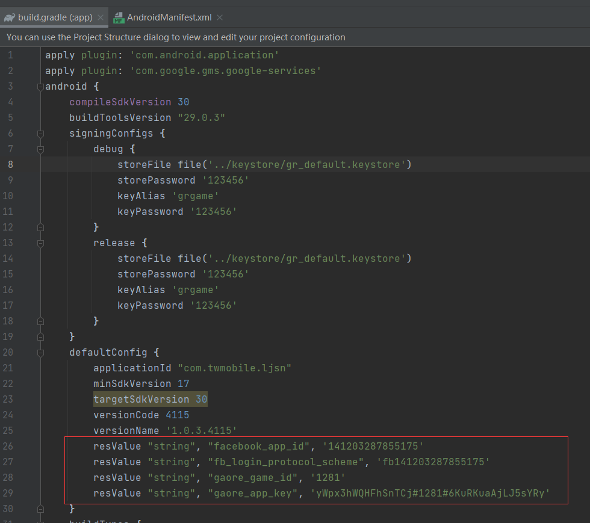
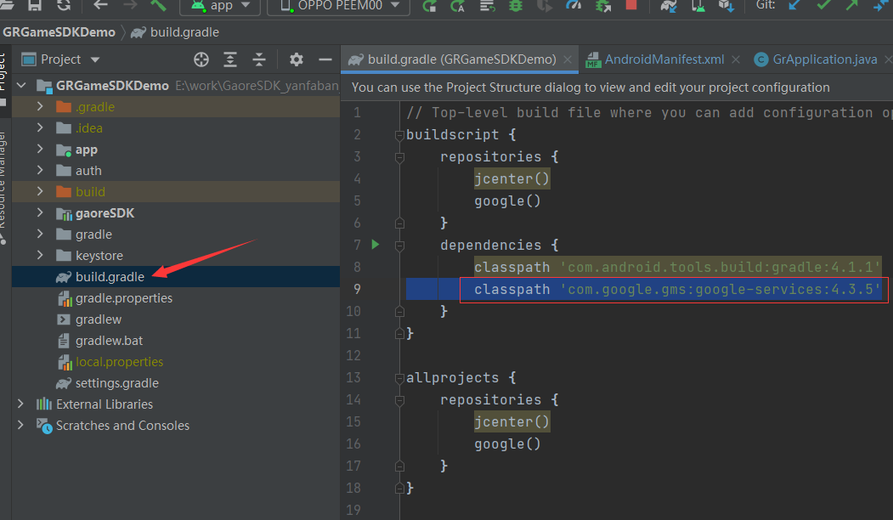
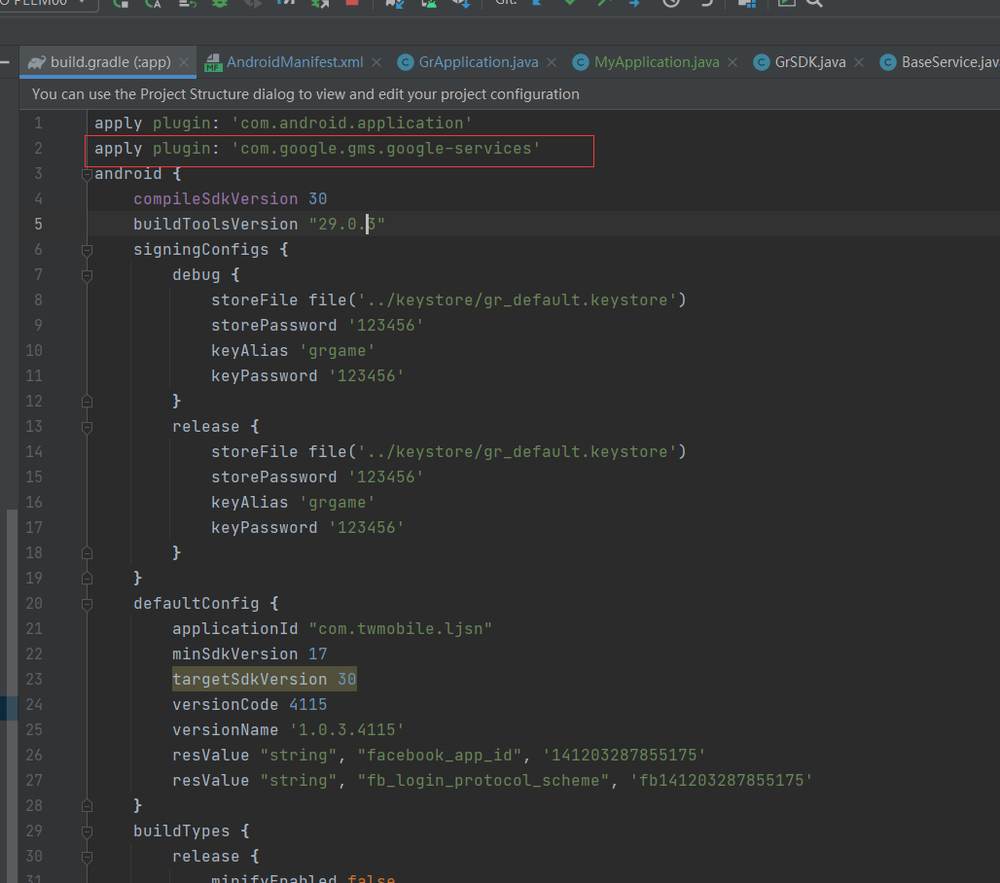

# 1 集成步骤

## 1.1 导入aar包

将物料中的将gaoreSDK_***.aar拷贝至游戏工程中，同时在build.gradle配置上。

```gradle
implementation(name: 'gaoreSDK_***', ext: 'aar')

implementation 'com.google.android.play:core:1.8.0'
implementation 'com.facebook.android:facebook-login:11.1.1'
implementation 'com.google.android.gms:play-services-auth:19.0.0'
implementation "com.android.billingclient:billing:4.0.0"
implementation 'androidx.recyclerview:recyclerview:1.2.1'
implementation platform('com.google.firebase:firebase-bom:28.2.1')
implementation 'com.google.firebase:firebase-analytics'
```

## 1.2 清单配置

### 1.2.1 Application配置

1.如果游戏 ***有自定义的Application*** ，那么请务必继承类com.gaore.mobile.GrApplication 。并且重写以下三个方法：

```java
@Override
public void onCreate() {
   super.onCreate();
}

@Override
public void onConfigurationChanged(@NonNull Configuration newConfig) {
   super.onConfigurationChanged(newConfig);
}

@Override
public void attachBaseContext(Context base) {
        super.attachBaseContext(base);
}
```

2.如果游戏 ***没有自定义的Application***，那么请按照如下要求在Manifest中的application节点配置上：

```xml
<application android:name="com.gaore.mobile.GrApplication">
```

## 1.3 build.gradle配置

### 1.3.1 签名配置

1.签名文件在物料中

```
signingConfigs {
    debug {
        storeFile file('../keystore/gr_default.keystore')
        storePassword '123456'
        keyAlias 'grgame'
        keyPassword '123456'
     }

    release {
        storeFile file('../keystore/gr_default.keystore')
        storePassword '123456'
        keyAlias 'grgame'
        keyPassword '123456'
     }
}
```

### 1.3.2 配置参数

1.在如下图所示位置加入：

```
resValue "string", "facebook_app_id", '高热提供参数'
resValue "string", "fb_login_protocol_scheme", '高热提供参数'
resValue "string", "gaore_game_id", '高热提供参数' 
resValue "string", "gaore_app_key",'高热提供参数'
```



### 1.3.3 配置firebase

1.将物料中的google-services.json放在根目录，和build.gradle文件同级。如下图所示：


2.在如下图所示位置加入：

```
classpath 'com.google.gms:google-services:4.3.5'
```



3.在如下图所示位置加入：

```
apply plugin: 'com.google.gms.google-services'
```


